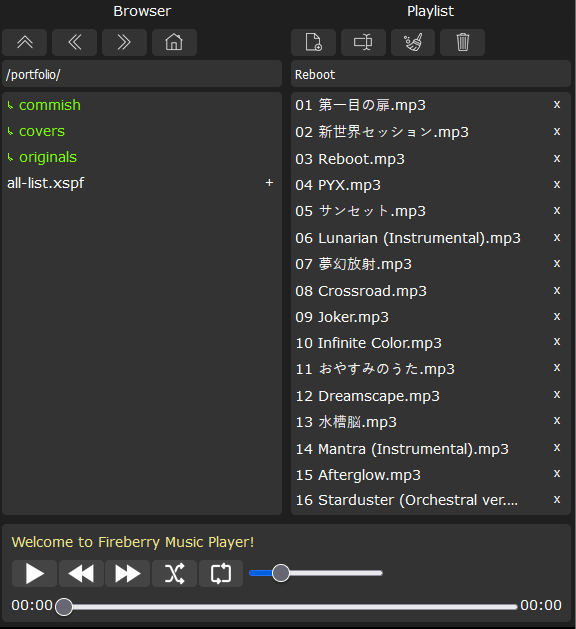
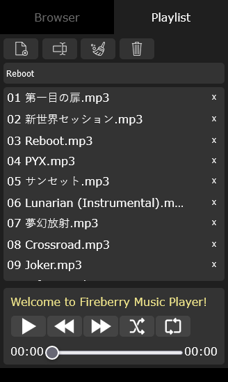

# juke
A simple web music player to learn javascript. 

Using a php backend to provide music library interface. 

Aimed for personal use.

Can be used by anyone in [live demo here](https://juke.testermelon.com)

# Screenshots

On small screen mobile:

